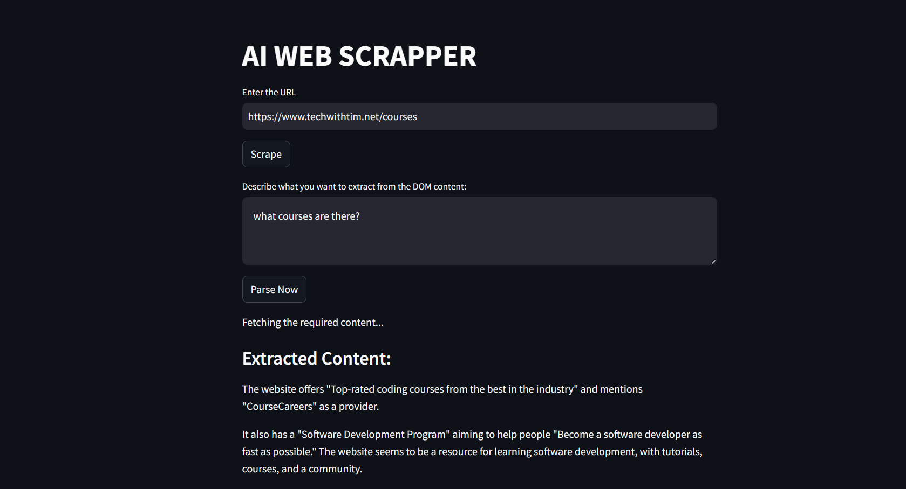

# AI Web Scraper

This is a powerful web scraping tool that combines Selenium for scraping dynamic content and Google's Gemini AI for intelligent data extraction.

## Features

- **Web Scraping**: Uses Selenium to scrape content from any website, including dynamic JavaScript-heavy sites.
- **AI Parsing**: Utilizes Google's Gemini 2.0 Flash model to intelligently extract specific information based on your natural language queries.
- **Clean UI**: Built with Streamlit for a simple and interactive user interface.

## Output Showcase



## How to Run

1.  **Clone the repository**
2.  **Install dependencies**:
    ```bash
    pip install -r requirements.txt
    ```
    *(Make sure you have `streamlit`, `selenium`, `beautifulsoup4`, `google-generativeai`, `python-dotenv`, and `webdriver-manager` installed)*

3.  **Set up API Key**:
    - Create a `.env` file in the root directory.
    - Add your Google Gemini API key:
      ```
      GOOGLE_API_KEY=your_api_key_here
      ```

4.  **Run the application**:
    ```bash
    streamlit run main.py
    ```

5.  **Usage**:
    - Enter a URL to scrape.
    - View the scraped DOM content.
    - Enter a description of what you want to extract (e.g., "List all product names and prices").
    - Click "Parse Now" to get the AI-extracted results.
